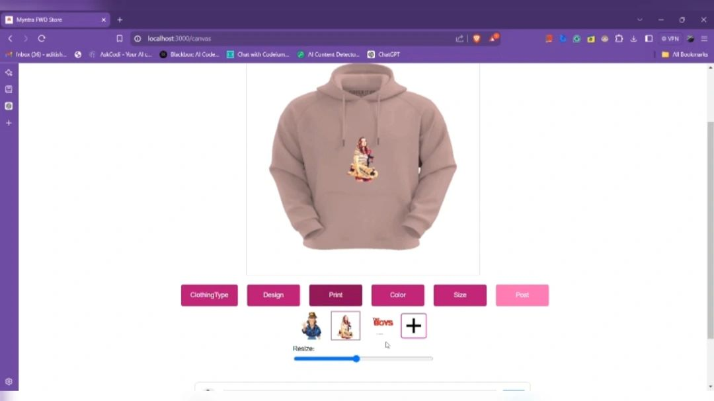
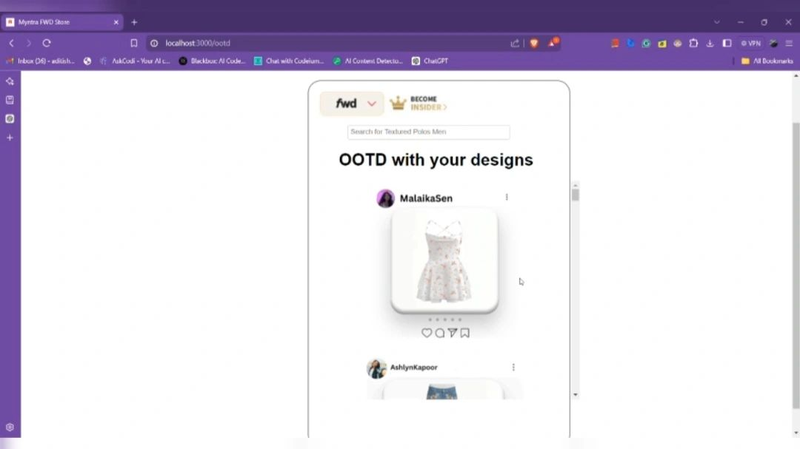
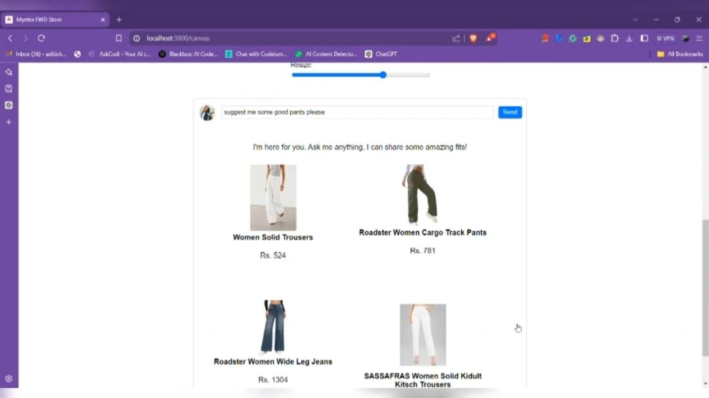

# Getting Started with Create React App

This project was bootstrapped with [Create React App](https://github.com/facebook/create-react-app).

## Available Scripts

In the project directory, you can run:

### `npm start`

Runs the app in the development mode.\
Open [http://localhost:3000](http://localhost:3000) to view it in your browser.

The page will reload when you make changes.\
You may also see any lint errors in the console.

### `npm test`

Launches the test runner in the interactive watch mode.\
See the section about [running tests](https://facebook.github.io/create-react-app/docs/running-tests) for more information.

### `npm run build`

Builds the app for production to the `build` folder.\
It correctly bundles React in production mode and optimizes the build for the best performance.

The build is minified and the filenames include the hashes.\
Your app is ready to be deployed!

See the section about [deployment](https://facebook.github.io/create-react-app/docs/deployment) for more information.

### `npm run eject`

**Note: this is a one-way operation. Once you `eject`, you can't go back!**

If you aren't satisfied with the build tool and configuration choices, you can `eject` at any time. This command will remove the single build dependency from your project.

Instead, it will copy all the configuration files and the transitive dependencies (webpack, Babel, ESLint, etc) right into your project so you have full control over them. All of the commands except `eject` will still work, but they will point to the copied scripts so you can tweak them. At this point you're on your own.

You don't have to ever use `eject`. The curated feature set is suitable for small and middle deployments, and you shouldn't feel obligated to use this feature. However we understand that this tool wouldn't be useful if you couldn't customize it when you are ready for it.

## Learn More

You can learn more in the [Create React App documentation](https://facebook.github.io/create-react-app/docs/getting-started).

To learn React, check out the [React documentation](https://reactjs.org/).

### Code Splitting

This section has moved here: [https://facebook.github.io/create-react-app/docs/code-splitting](https://facebook.github.io/create-react-app/docs/code-splitting)

### Analyzing the Bundle Size

This section has moved here: [https://facebook.github.io/create-react-app/docs/analyzing-the-bundle-size](https://facebook.github.io/create-react-app/docs/analyzing-the-bundle-size)

### Making a Progressive Web App

This section has moved here: [https://facebook.github.io/create-react-app/docs/making-a-progressive-web-app](https://facebook.github.io/create-react-app/docs/making-a-progressive-web-app)

### Advanced Configuration

This section has moved here: [https://facebook.github.io/create-react-app/docs/advanced-configuration](https://facebook.github.io/create-react-app/docs/advanced-configuration)

### Deployment

This section has moved here: [https://facebook.github.io/create-react-app/docs/deployment](https://facebook.github.io/create-react-app/docs/deployment)

### `npm run build` fails to minify

This section has moved here: [https://facebook.github.io/create-react-app/docs/troubleshooting#npm-run-build-fails-to-minify](https://facebook.github.io/create-react-app/docs/troubleshooting#npm-run-build-fails-to-minify)
 
 # Myntra Cloth Canvas
 
 
 
 
 
 ## Overview
 
 Myntra Cloth Canvas is an innovative web application designed to revolutionize the online fashion experience. The project introduces a unique Cloth-Canvas feature, empowering users to design and customize their own clothing pieces directly on the platform. With an integrated AI chatbot, users receive personalized fit recommendations and styling advice to complete their look.
 
 ## Features
 
 ### 1. Cloth-Canvas Designer
 - **Interactive Canvas:** Users can select clothing types and customize them with colors, patterns, and prints.
 - **Drag-and-Drop UI:** Easily add, move, and modify design elements.
 - **Preview Designs:** Instantly visualize your creations before saving or sharing.
 
 ### 2. AI Chatbot
 - **Fit Recommendations:** Get AI-powered suggestions for sizes and styles based on your preferences and body type.
 - **Style Advice:** Receive tips to complete your look and match your designs with trending outfits.
 
 ### 3. OOTD (Outfit Of The Day) Page
 - **Community Feed:** Share your custom designs with other users and view their creations.
 - **Streaks & Rewards:** Maintain posting streaks to earn coupons and gift cards at milestones.
 - **Engagement:** Like, comment, and interact with the community to stay inspired.
 
 ### 4. Trend-Centric Recommendations
 - **Personalized Trends:** Discover trending designs and styles tailored to your interests.
 - **AI-Driven Suggestions:** The platform adapts to your activity and preferences for better recommendations.
 
 ## Project Structure
 
 - **backend/**: Contains the backend server (`app.py`) for handling API requests and AI chatbot logic.
 - **public/**: Static assets including images, icons, and manifest files.
	 - **assets/images/readme/**: Contains images used in this README and for documentation.
 - **src/**: Frontend source code (React).
	 - **components/**: UI components like Canvas, Chatbot, Hero, Navbar, and OOTD.
	 - **utils/**: Utility functions for clothing shapes and design logic.
 
 ## Getting Started
 
 1. **Clone the repository:**
		```powershell
		git clone https://github.com/aditi0403/Myntra-Cloth-Canvas.git
		cd Myntra-Cloth-Canvas
		```
 2. **Install dependencies:**
		```powershell
		npm install
		```
 3. **Start the development server:**
		```powershell
		npm start
		```
 4. **Run the backend server:**
		```powershell
		cd backend
		python app.py
		```
 
 ## Images & Visuals
 
 - **Canvas Feature:**
	 
 - **OOTD Feed:**
	 
 - **Recommendations:**
	 
 
 ## Innovation & Impact
 
 This project aims to:
 - Enhance user engagement through interactive design and social features.
 - Provide personalized shopping experiences using AI.
 - Foster a creative community around fashion and design.
 - Reward active users to encourage regular participation.
 
 ## Contributing
 
 Contributions are welcome! Please open issues or submit pull requests for improvements, new features, or bug fixes.
 
 ## License
 
 This project is licensed under the MIT License.
